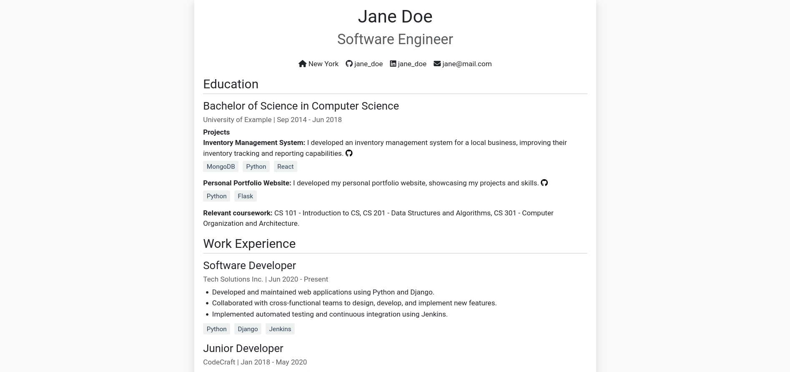
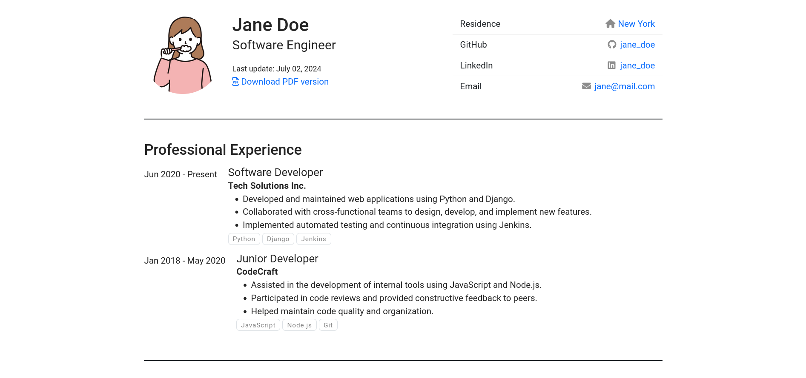

# Web Resume Builder

A powerful and flexible web-based resume generator using Python, Jinja2, and Playwright.

## Features

- Generate a static website and PDF version of your resume
- Customize your resume content using YAML
- Choose from multiple HTML templates
- Automatically deploy to GitHub Pages
- Easy to use and modify

## Demo

View a live demo: [https://disaa0.github.io/web-resume](https://disaa0.github.io/web-resume)

## Quick Start

1. Use this template to create a new repository
2. Clone your new repository
3. Set up a virtual environment:
   ```sh
   python -m venv .venv
   source .venv/bin/activate  # On Windows, use `.venv\Scripts\activate`
   ```
4. Install dependencies:
   ```sh
   pip install -r requirements.txt
   playwright install chromium
   ```
5. Customize your resume in `metadata/metadata.yaml`
6. Run the generator:
   ```sh
   python app.py
   ```
7. Your resume will be generated in the `dist` folder

## Project Structure

```
.
├── app.py                 # Main application script
├── assets/                # Static assets (images, icons)
├── dist/                  # Generated output (HTML, PDF)
├── metadata/              # Resume content (YAML)
├── templates/             # HTML templates
├── tests/                 # Unit tests
├── previews/              # Template previews
├── requirements.txt       # Python dependencies
└── README.md              # This file
```

## Customization

### Content

Edit `metadata/metadata.yaml` to update your resume content. This file includes:

- Personal information
- Work experience
- Education
- Skills
- Projects

### Design

1. Choose a template by updating the `template` field in `metadata/metadata.yaml`:
   ```yaml
   template: modern.html  # or formal.html
   ```
2. Modify existing templates or create new ones in the `templates/` directory
3. Customize styles by editing the CSS within the template files

### Assets

Place your profile photo, favicon, or other assets in the `assets/` directory and update the references in `metadata/metadata.yaml`.

## Generating Your Resume

Run `python app.py` to generate your resume. This will:

1. Create a static HTML version in `dist/index.html`
2. Generate a PDF version (if enabled in metadata)
3. Copy necessary assets to the `dist/` folder

## Deployment

### GitHub Pages

1. Push your changes to GitHub
2. Enable GitHub Pages in your repository settings
3. Set the source to the `gh-pages` branch
4. Your resume will be available at `https://[username].github.io/[repository-name]`

# Web Resume Builder

A powerful and flexible web-based resume generator using Python, Jinja2, and Playwright.

[... previous sections remain unchanged ...]

## Templates

Choose from the selection of templates to create your resume.

### Formal Template



### Modern Template



To select a template, update the `template` field in `metadata/metadata.yaml`:

```yaml
template: modern.html  # or formal.html
```

[... rest of the README remains unchanged ...]

## Contributing

Contributions are welcome! Please feel free to submit a Pull Request.
